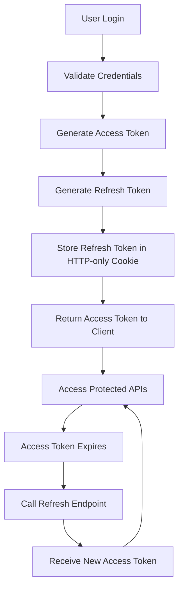

# MERN Authentication System

A secure and production-ready MERN Stack authentication application built with React, Node.js, Express, MongoDB, and JWT. The project implements a two-token authentication flow using access tokens and refresh tokens, allowing users to register, log in, access protected routes, refresh sessions automatically, and log out securely.

## Project Overview

This project demonstrates a modern authentication system suitable for real-world web applications. JWT-based authentication is used to secure API access while keeping the user experience smooth. An access token is used for short-lived API access, and a refresh token is used to obtain a new access token without requiring the user to sign in again.

Using this approach improves both security and usability. Access tokens expire quickly, while refresh tokens remain valid for a longer period and are stored securely in HTTP-only cookies.

## Features

- User Registration
- User Login
- Password Hashing with bcrypt
- JWT Authentication
- Access Token Support
- Refresh Token Support
- HTTP-only Cookie Storage
- Protected Routes
- Automatic Token Refresh
- Logout
- Responsive UI
- Form Validation
- Error Handling

## Authentication Flow



## Tech Stack

### Frontend

- React.js
- Vite
- React Router DOM
- Tailwind CSS
- Axios

### Backend

- Node.js
- Express.js
- MongoDB Atlas
- Mongoose
- JWT
- bcryptjs
- cookie-parser
- cors

### Deployment

- Frontend: Vercel
- Backend: Render
- Database: MongoDB Atlas

## Folder Structure

```text
gath-assignment/
├── client/
│   ├── public/
│   ├── src/
│   │   ├── assets/
│   │   ├── components/
│   │   ├── context/
│   │   ├── hooks/
│   │   ├── pages/
│   │   ├── routes/
│   │   ├── services/
│   │   ├── utils/
│   │   ├── App.jsx
│   │   ├── main.jsx
│   │   └── index.css
│   ├── package.json
│   ├── tailwind.config.js
│   └── vite.config.js
├── server/
│   ├── config/
│   ├── controllers/
│   ├── middleware/
│   ├── models/
│   ├── routes/
│   ├── utils/
│   ├── server.js
│   └── package.json
└── README.md
```

## API Endpoints

| Method | Endpoint | Description |
| --- | --- | --- |
| POST | /api/auth/register | Register a new user |
| POST | /api/auth/login | Log in a user and issue tokens |
| POST | /api/auth/refresh | Refresh an expired access token |
| POST | /api/auth/logout | Log out the current user |
| GET | /api/dashboard | Access protected dashboard data |

## Environment Variables

Create a `.env` file in the `server` directory with values similar to the following:

```env
PORT=5000
MONGO_URI=mongodb://localhost:27017/auth-app
ACCESS_TOKEN_SECRET=your_access_token_secret
REFRESH_TOKEN_SECRET=your_refresh_token_secret
CLIENT_URL=http://localhost:5173
NODE_ENV=development
```

## Installation

### 1. Clone the repository

```bash
git clone <your-repository-url>
cd gath-assignment
```

### 2. Install frontend dependencies

```bash
cd client
npm install
```

### 3. Install backend dependencies

```bash
cd ../server
npm install
```

### 4. Run the development servers

Start the backend:

```bash
cd server
npm run dev
```

Start the frontend:

```bash
cd client
npm run dev
```

## Deployment

### Frontend

Deploy the React app to Vercel and configure the environment variables for the production API URL.

### Backend

Deploy the Express server to Render and ensure the server environment variables are configured correctly.

### Database

Use MongoDB Atlas for a managed cloud database and update the connection string in the server environment variables.

## Security Features

This project includes several important security practices:

- Password hashing using bcrypt
- JWT-based authentication for protected endpoints
- Short-lived access tokens for safer API access
- Refresh tokens for session continuity without re-login
- HTTP-only cookies for refresh token storage
- SameSite and Secure cookie settings where applicable
- Protected routes to restrict access to authenticated users
- Environment variables for sensitive credentials

## Screenshots

### Home

(Add screenshot)

### Login

(Add screenshot)

### Register

(Add screenshot)

### Dashboard

(Add screenshot)

## Future Improvements

Possible enhancements for the project include:

- Forgot Password
- Email Verification
- OAuth Login
- Refresh Token Rotation
- Role-Based Authorization
- User Profile Management
- Account Settings
- Password Reset

## License

This project is licensed under the MIT License.

## Author

Name: Your Name

GitHub: https://github.com/yourusername

LinkedIn: https://linkedin.com/in/yourusername

Email: your.email@example.com
